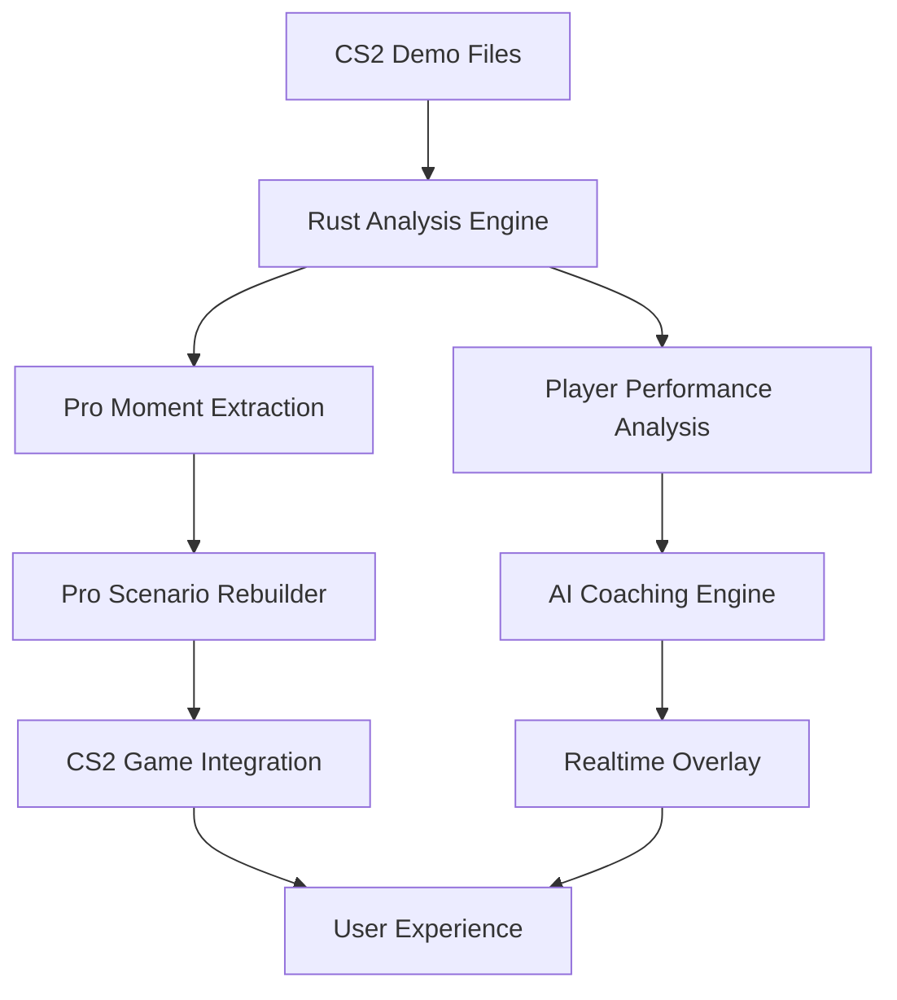
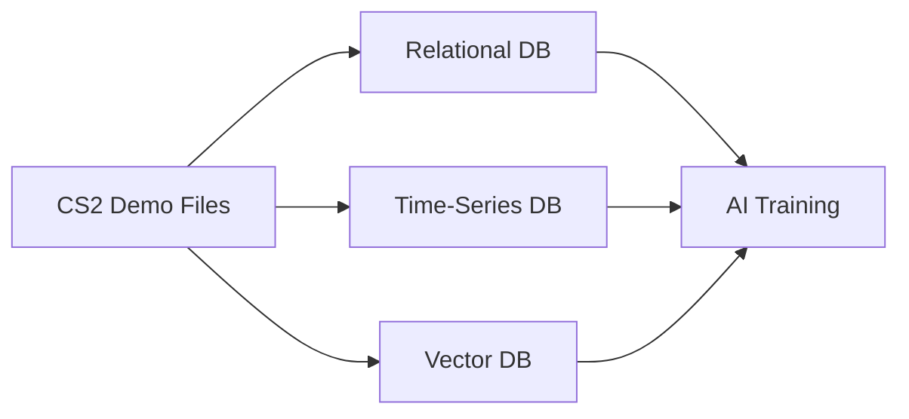

A Rust-based prototype for a CS2 demo analysis and AI training system has been developed, featuring core components like `DemoAnalyzer` and `PlayerSnapshot` for parsing and modeling player states. The system aims to provide AI-driven coaching, pro player comparison, and support for ephemeral training servers, with an architecture designed for scalability and future multi-game expansion.

# CS2 Demo Analysis & AI Training System: Rust Prototype

## 1. Core System Components and Architecture
### 1.1. High-Level System Architecture
The high-level architecture of the CS2 Demo Analysis & AI Training System is designed to ingest raw CS2 demo files, process them through a **Rust-based analysis engine**, and deliver a suite of features aimed at player improvement and strategic insights. The core workflow begins with **CS2 demo files (.dem)** being fed into the system. These files are first processed by the **Rust Analysis Engine**, which is responsible for parsing the binary data and extracting meaningful features. This engine produces two main types of output: **Player Performance Analysis** data, which provides a detailed breakdown of individual player actions and statistics, and **Pro Moment Extraction**, which identifies and characterizes significant gameplay events. The extracted Pro Moments, represented as `BehavioralVector`s, can then be used by a **Pro Scenario Rebuilder** to recreate these situations in **Ephemeral Training Servers**, allowing users to practice against AI that clones professional player behaviors. Simultaneously, the Player Performance Analysis feeds into an **AI Coaching Engine**, which generates personalized feedback. This feedback, along with insights from the Pro Scenario Rebuilder, can be delivered to the user via a **Realtime Overlay** during demo playback or integrated directly into the game through **CS2 Game Integration**, enhancing the overall **User Experience**.



*Figure 1: High-Level System Architecture Overview*

### 1.2. Rust Prototype: `DemoAnalyzer` and `PlayerSnapshot`
The core of the proposed Rust-based CS2 demo analysis system revolves around the **`DemoAnalyzer` struct** and the **`PlayerSnapshot` struct**. The `DemoAnalyzer` is responsible for ingesting CS2 demo files and extracting meaningful data for further processing and AI-driven insights. As outlined in the initial design, the `DemoAnalyzer` struct contains a **`Demo` object** and a **`match_id` string**. Its primary functions include **`extract_features`** and **`identify_key_moments`**. The `extract_features` method is designed to process the demo file and generate a collection of `PlayerSnapshot` objects. These snapshots are intended to capture crucial in-game player states at various points in time, such as position, aim (including view angles and crosshair placement), health, and currently equipped weapon data. The `identify_key_moments` method aims to analyze the sequence of events and player states to pinpoint significant gameplay situations, like clutch scenarios or important duels, which can then be represented as `BehavioralVector`s for deeper analysis or AI training.

The `PlayerSnapshot` struct is designed to be a detailed representation of a player's in-game status at a given tick. It includes fundamental attributes such as the current **tick number**, the player's unique **ID**, their **health** and **armor** levels, their **velocity** in three dimensions (X, Y, Z), their **position** in the game world (also X, Y, Z), the **active weapon** they are holding, the **ammunition count** in the current clip and in reserve, their **alive/dead status**, whether they are **airborne**, **scoped in**, or **walking**, and the remaining duration of any **flashbang effects**. These structures form the foundational data model for the Rust prototype, enabling the parsing and initial analysis of CS2 demo files to extract actionable insights for players and coaches. The design emphasizes a clear separation of concerns, with `Demo` handling metadata, `PlayerSnapshot` representing atomic player states, and `DemoAnalyzer` orchestrating the analysis.

### 1.3. Database Architecture for Scalability
The proposed database architecture for the CS2 demo analysis system is designed to support **scalability** and efficient data retrieval for AI training and complex analytics. It employs a multi-faceted approach, utilizing different types of databases optimized for specific data characteristics and query patterns. The architecture diagram indicates that CS2 demo files will be ingested and processed, with the resulting data distributed across three main database systems: a **Relational Database**, a **Time-Series Database**, and a **Vector Database**. The **Relational Database** is likely intended for storing structured metadata about matches, players, and overall game events. This could include information such as match outcomes, player statistics per match or round, map played, and timestamps. The **Time-Series Database** is crucial for handling the continuous stream of player state data captured at each tick of the demo. Each `PlayerSnapshot`, with its associated tick and player ID, is a natural fit for a time-series model, allowing for efficient querying of player movements, actions, and state changes over time. This is essential for trend analysis, pattern recognition, and reconstructing the flow of the game. Finally, the **Vector Database** is intended for storing and querying high-dimensional vectors, such as the `BehavioralVector` outputs from the `identify_key_moments` method. These vectors could represent complex player behaviors, tactical patterns, or learned embeddings from AI models. The Vector Database enables fast similarity searches and clustering, which are fundamental for tasks like playstyle comparison, identifying common tactical errors, or finding similar pro-player moments for training scenarios. All three database systems feed into the **AI Training pipeline**, providing a rich and diverse dataset for machine learning models to learn from and generate insights. This hybrid approach ensures that the system can handle large volumes of demo data, support complex analytical queries, and provide the necessary infrastructure for advanced AI-driven features.



*Figure 2: Database Architecture for Scalability*

## 2. Key Features and Functionalities
### 2.1. Pro Player Comparison and Skill Gap Analysis
A cornerstone feature of the system is **Pro Player Comparison and Skill Gap Analysis**. This functionality aims to provide users with a detailed understanding of how their gameplay metrics stack up against those of professional players. By analyzing a user's demo files and comparing them to an extensive database of professional player performances, the system can highlight specific areas for improvement. This analysis will cover various aspects of gameplay, including **aim (e.g., crosshair placement, flick accuracy, spray control)**, **positioning (e.g., map control, angle selection, rotation timing)**, and **utility usage (e.g., effectiveness of grenade throws, smoke setups, flashbang coordination)**. The system will generate a **skill gap report**, pinpointing strengths and weaknesses relative to a chosen pro player or a pro player archetype. Furthermore, a **playstyle similarity scoring** mechanism could identify which professional player's style the user most closely resembles, offering insights into potential role models. Based on the identified skill gaps and playstyle, a **role recommendation engine** might suggest optimal in-game roles or agents that suit the user's current abilities and potential for growth. This feature empowers players to focus their practice on specific, quantifiable deficiencies, accelerating their skill development.

### 2.2. Ephemeral Training Servers with AI Behavior Cloning
The system will offer **Ephemeral Training Servers** powered by **AI Behavior Cloning**. This advanced feature allows users to practice in dynamically generated scenarios that replicate specific in-game situations or the playstyles of professional players. Using data extracted from pro demos and represented as `BehavioralVector`s, the AI can **clone pro player behaviors**, enabling users to face off against bots that mimic the decision-making, movement, and aim of top-tier competitors. These servers can be used to **recreate crucial match moments**, such as a difficult clutch situation or a specific site execute, allowing players to repeatedly practice and refine their responses. The AI opponents in these training servers can feature **adaptive difficulty scaling**, meaning their skill level can be adjusted based on the user's performance, ensuring a consistently challenging yet achievable training environment. This provides a highly targeted and efficient way to practice, moving beyond generic bot aim maps to scenario-based training that directly addresses specific weaknesses or prepares players for particular in-game challenges. The ephemeral nature of these servers means they can be spun up on demand and tailored to individual training needs.

### 2.3. Live Coaching System with Real-time Feedback
The **Live Coaching System** is designed to provide users with **real-time feedback** as they review their own demo files or even during live gameplay (if integrated with game state integration features). This system leverages the AI Coaching Engine to analyze player actions and offer immediate, actionable advice. A key component of this is **crosshair placement correction**, where the system will analyze the user's aiming habits and suggest improvements, such as keeping the crosshair at head level or pre-aiming common angles more effectively. Beyond aim, the system will also offer **tactical decision analysis**, evaluating choices related to positioning, utility usage, and engagement strategies. For example, it might highlight instances where a player took an unfavorable duel, misused a grenade, or failed to rotate in a timely manner. The feedback will be delivered through a **realtime overlay** during demo playback, visually indicating areas of concern and suggesting better alternatives. This immediate, contextual feedback helps players to quickly identify and understand their mistakes, leading to faster learning and improvement compared to traditional post-match review methods.

### 2.4. Multi-Game Support and Unified Architecture
A significant long-term goal for the system is to provide **Multi-Game Support** through a **Unified Architecture**. While the initial focus is on CS2, the underlying design principles and core components are intended to be extensible to other popular competitive FPS games such as **Valorant** and **Apex Legends**. This will be achieved by developing game-agnostic data models and analysis modules where possible, and game-specific parsers and adapters where necessary. For instance, a common `PlayerSnapshot` structure might be used across games, with specific fields populated based on the game being analyzed. The AI models for behavior cloning and coaching could also be trained on data from multiple games, potentially allowing for cross-game skill transfer insights. The unified architecture will streamline the development of new game integrations and allow for shared infrastructure and analytics capabilities. This approach not only broadens the potential user base but also allows for comparative analysis across different FPS titles, offering unique insights into the nuances of each game's mechanics and meta.

## 3. Technical Implementation Details
### 3.1. CS2 Demo Parsing and Feature Extraction
The initial phase of the CS2 demo analysis system heavily relies on the robust parsing of **.dem files** and the subsequent extraction of relevant features. The project plan specifies a "Rust demo parser" as a foundational deliverable. The `DemoAnalyzer` struct's **`extract_features` method** is central to this, tasked with processing the `Demo` object and returning a `Vec<PlayerSnapshot>`. The `PlayerSnapshot` is expected to contain detailed information such as player position, aim (which encompasses view angles and crosshair placement), health, and weapon data. Research into existing tools and libraries has highlighted several options. The **`LaihoE/demoparser`** ,  (also referred to as `demoparser2` ) is a prominent Rust-based CS2 parser that exposes Python and JavaScript APIs but performs the core parsing in Rust. It is noted for its efficiency, with benchmarks showing high data processing speeds e.g.over700MB/sonahigh-endPC, and its support for a wide array of player state fields over100. This library allows querying the demo for specific events or tick data, which aligns with the need to extract discrete `PlayerSnapshot` instances. For example, the Python API for `demoparser2` shows how to parse events like "player_death" and extract player properties such as "X", "Y" coordinates, and other global properties like "total_rounds_played" at specific ticks , . The `awpy` library, which uses `demoparser2` as its backend, also demonstrates parsing ticks and obtaining player properties like "X", "Y", "Z", "health", "armor_value", "has_helmet", "has_defuser", and "inventory" . This confirms the availability of detailed player state information that can populate the `PlayerSnapshot` struct.

The parsing process itself involves reading the binary .dem file, which records game state at regular intervals (ticks). CS2 demos can have varying tick rates e.g.32forMatchMaking64forFaceitandpotentiallyhigherforprofessionalmatches. Each tick contains a wealth of information about entities in the game, including players, their properties, and game events. Libraries like `demoinfocs-golang` (for CS:GO, but conceptually similar) allow for frame-by-frame parsing and event handling, providing access to player positions, health, active weapons, and events like weapon fire or grenade detonations , . The `LaihoE/demoparser` adopts a "query" approach, allowing developers to request specific data points or events, which can be more efficient than streaming all data if only particular information is needed , . For the `extract_features` method, this would involve iterating through ticks or specific events and, for each relevant tick, creating a `PlayerSnapshot` instance populated with the current state of each player. The performance of this extraction is critical; `LaihoE/demoparser` boasts impressive speeds, with one benchmark processing 4.6GB of demos in 6.14 seconds on a gaming PC (Ryzen 5900x, NVMe SSD) , . Such performance is vital for handling large volumes of demo data efficiently. The choice of which player properties to extract will depend on the specific analyses planned, but the available fields are extensive, covering everything from basic vitals to complex weapon and game state information , . CS2 demos are encoded using **Google's Protocol Buffers (protobuf)** , and a robust Rust parser would likely need to incorporate protobuf definitions for CS2's specific message formats, potentially leveraging existing Rust protobuf libraries and CS2-specific definitions .

### 3.2. Modeling Player State: `PlayerSnapshot` Struct
The **`PlayerSnapshot` struct** is a fundamental data structure in the proposed Rust-based CS2 demo analysis system. It is designed to encapsulate the state of a player at a specific moment in time (a "tick" in the demo file). The `extract_features` method of the `DemoAnalyzer` is expected to return a vector of these `PlayerSnapshot` instances, representing the evolving state of players throughout the match. Based on the project outline and insights from existing demo parsers likethe`LaihoE/demoparser`and`awpy`, the `PlayerSnapshot` struct would need to contain fields for player identification (SteamID, name, team), positional data (3D coordinates X, Y, Z), aim data (view angles pitch, yaw, potentially crosshair placement), vital statistics (health, armor, helmet, defuser), weapon information (active weapon, ammo counts, inventory), movement state (velocity, crouching, jumping, on-ground), utility (grenades), and game context (tick, round). The `LaihoE/demoparser` supports over 100 detailed player state fields , indicating a rich set of data available for inclusion. For example, parsing ticks with `demoparser2` can yield "X", "Y", "Z", "health", "armor_value", "has_helmet", "has_defuser", and "inventory" . The `PlayerSnapshot` would serve as the primary input for various analytical functions, including aim analysis, positioning evaluation, and the generation of `BehavioralVector`s for key moment identification. The design of this struct must be comprehensive enough to capture all necessary details for the planned AI-driven insights and comparisons.

The `PlayerSnapshot` struct needs to be designed to accommodate the rich set of data points available from CS2 demos, as indicated by the `LaihoE/demoparser` field list . This includes not only basic attributes like health and position but also more nuanced state information. For instance, fields related to movement such as `m_flVelocityModifier` (velocity modifier), `m_bStrafing` (is strafing), `m_flStamina` (stamina), and various ducking/jumping states (`m_nDuckTimeMsecs`, `m_bInCrouch`, `m_nCrouchState`, `m_bDucked`, `m_bDucking`, `m_bInDuckJump`, `m_flJumpUntil`, `m_flJumpVel`, `m_flFallVelocity`) provide a granular view of player actions . Similarly, equipment-related fields like `m_unRoundStartEquipmentValue` and `m_unCurrentEquipmentValue`, along with `m_iWeaponPurchasesThisMatch` and `m_iWeaponPurchasesThisRound`, offer insights into a player's economic strategy and loadout choices . The `PlayerSnapshot` should also capture state flags like `m_bIsDefusing`, `m_bIsGrabbingHostage`, `m_bInBombZone`, `m_bInBuyZone`, `m_bWaitForNoAttack`, and `m_bIsLookingAtWeapon` . These flags are critical for contextualizing player actions and understanding their tactical decisions. The inclusion of `m_aimPunchAngle` and `m_aimPunchAngleVel` is vital for accurately representing the player's current view direction, especially during combat, as these account for recoil effects . The `PlayerSnapshot` will serve as the atomic unit of data for analyzing individual player performance, and its comprehensiveness directly impacts the depth and accuracy of the AI coaching and pro comparison features.

### 3.3. AI Coaching Logic: Crosshair Placement Analysis
The AI coaching system's **crosshair placement analysis** is a critical component for providing actionable feedback to players. This feature aims to identify suboptimal crosshair positioning and suggest corrections to improve aiming efficiency and reaction time. The core of this analysis involves comparing the player's actual crosshair position with an "ideal" or "pro-level" crosshair placement in various in-game situations. To achieve this, the system must understand several key aspects of Counter-Strike 2 (CS2) game mechanics, including **player hitboxes**, **weapon spread**, and common engagement angles . The AI coaching engine will process data extracted from demo files, specifically player snapshots containing aim coordinates, and map geometry to determine if the crosshair was positioned effectively. For instance, the system will check if the crosshair was at head level where an enemy was likely to appear, or if it was too close to a corner, making it difficult to react to wider peeks. The analysis will also consider the player's movement, as static crosshair placement can be predictable, and dynamic adjustments are often necessary .

To implement crosshair placement correction, the system needs to model the CS2 game environment accurately. This includes understanding the dimensions of player models and their hitboxes. In CS2, all agents have **identical hitboxes**, which are divided into regions: Head, Chest and Arms, Stomach, and Legs, each with different damage multipliers (e.g., headshots deal 400% damage) . The system will use this information to prioritize head-level crosshair placement. Furthermore, the AI must account for **weapon spread and inaccuracy**, which vary between weapons and are affected by movement and firing patterns . While the exact unit values for spread might be complex to obtain directly from demo files, general weapon behavior and optimal engagement distances can be factored into the coaching advice. For example, the system could analyze if a player is attempting long-range sprays with a weapon known for high spread, suggesting instead burst fire or repositioning. The `PlayerSnapshot` struct, which includes player position, aim angles, and weapon information, will be crucial for this analysis. By comparing the player's aim vector with the position of enemy players (or common enemy positions), the AI can determine the angular offset and suggest corrections. This might involve highlighting areas on the screen or providing textual feedback like "aim higher" or "pre-aim further from the corner." The AI coaching logic will also incorporate map knowledge, understanding common angles, choke points, and peek spots . The system can be trained on professional player demos to learn common pre-aim locations and how pros adjust their crosshair while clearing sites or holding angles. This "pro-level" data can then be used as a benchmark.

### 3.4. Identifying Key Moments: `BehavioralVector`
The `DemoAnalyzer` struct includes a method **`identify_key_moments`** which is intended to return a `Vec<BehavioralVector>`. This implies that "key moments" in a CS2 demo are to be represented or characterized by these **`BehavioralVector` structures**. While the exact nature of a `BehavioralVector` is not fully defined in the provided project outline, its purpose is to encapsulate crucial gameplay situations, such as **clutch scenarios or important duels**, in a format suitable for further analysis, AI training, or reconstruction in ephemeral training servers. A `BehavioralVector` could be a feature vector derived from a sequence of `PlayerSnapshot` instances leading up to and including the key moment. This vector might encode information about player positions, health, weapon states, utility usage, opponent locations, and the outcome of the engagement. For example, in a clutch situation, the `BehavioralVector` might capture the state of the player attempting the clutch, the number and known positions of remaining enemies, the objective status (bomb planted, time remaining), and the player's actions (e.g., aggressive push, defensive hold, utility usage pattern).

The process of identifying these key moments would involve analyzing the stream of game events and player states. This could be **rule-based** (e.g., a clutch is defined as a 1vX situation in the last 30 seconds of a round) or driven by more sophisticated **machine learning models** that learn to recognize significant patterns. For instance, a duel could be identified by tracking `player_hurt` or `weapon_fire` events involving two players in close proximity and within a short timeframe. The `BehavioralVector` representing this duel would then capture the state of both players immediately before the duel, the actions taken during the duel (e.g., movement, shots fired, hits landed), and the result. The `LaihoE/demoparser` allows querying for specific game events like "player_death" , , which can serve as triggers for identifying potential key moments. Once a potential key moment is identified, the relevant `PlayerSnapshot` data surrounding that event would be processed to create the `BehavioralVector`. These vectors are crucial for the "Pro Moment Extraction" and "AI Coaching Engine" components of the overall system architecture, enabling the system to learn from and recreate impactful gameplay scenarios. The structure of the `BehavioralVector` would need to be designed carefully to capture the essence of these moments in a quantifiable way, possibly involving techniques like one-hot encoding for categorical data (e.g., weapon type, map area) and normalization for continuous data (e.g., health, distance to opponent).

## 4. Rust Prototype Implementation
### 4.1. `PlayerSnapshot` Struct Definition
The `PlayerSnapshot` struct is a cornerstone of the Rust prototype, designed to encapsulate the detailed state of a player at a specific game tick. Its definition, as refined through iterative analysis of available demo parsing tools and their output capabilities , , includes a comprehensive set of fields. These fields are crucial for enabling the various analytical features envisioned for the CS2 Demo Analysis & AI Training System. The struct is defined as follows:

```rust
#[derive(Debug, Clone)]
pub struct PlayerSnapshot {
    pub tick: i32,                 // The game tick number
    pub player_id: u32,            // Unique identifier for the player
    pub health: i32,               // Player's current health points
    pub armor: i32,                // Player's current armor points
    pub velocity_x: f32,           // Player's velocity along the X-axis
    pub velocity_y: f32,           // Player's velocity along the Y-axis
    pub velocity_z: f32,           // Player's velocity along the Z-axis
    pub position_x: f32,           // Player's X-coordinate in the game world
    pub position_y: f32,           // Player's Y-coordinate in the game world
    pub position_z: f32,           // Player's Z-coordinate in the game world
    pub active_weapon: String,     // Name of the currently active weapon
    pub ammo_clip: i32,            // Ammunition count in the current weapon's clip
    pub ammo_reserve: i32,         // Reserve ammunition for the active weapon
    pub is_alive: bool,            // Flag indicating if the player is alive
    pub is_airborne: bool,         // Flag indicating if the player is in the air
    pub is_scoped: bool,           // Flag indicating if the player is scoped in
    pub is_walking: bool,          // Flag indicating if the player is walking
    pub flash_duration: f32,       // Remaining duration of flashbang effect
    pub angle_x: f32,              // Player's horizontal view angle (yaw)
    pub angle_y: f32,              // Player's vertical view angle (pitch)
    pub angle_z: f32,              // Player's roll angle (less commonly used in FPS analysis)
}
```
Each field is carefully chosen to represent a specific aspect of the player's in-game state. For instance, `tick` and `player_id` provide the temporal and identity context for the snapshot. Health and armor (`health`, `armor`) are fundamental to a player's survivability. Movement dynamics are captured by velocity (`velocity_x`, `velocity_y`, `velocity_z`) and position (`position_x`, `position_y`, `position_z`). Combat readiness and capabilities are detailed by `active_weapon`, `ammo_clip`, and `ammo_reserve`. Various boolean flags (`is_alive`, `is_airborne`, `is_scoped`, `is_walking`) describe discrete states, while `flash_duration` quantifies the impact of utility. The `angle_x`, `angle_y`, and `angle_z` fields are particularly important for analyzing aiming behavior and crosshair placement, which is a key component of the proposed AI coaching system. The `#[derive(Debug, Clone)]` attribute allows for convenient printing of the struct for debugging purposes and enables the creation of independent copies of `PlayerSnapshot` instances, which is often necessary when manipulating or storing these data points.

### 4.2. `Demo` Struct Definition
The `Demo` struct serves as a container for metadata and contextual information related to a specific Counter-Strike 2 demo file being analyzed. This struct is designed to hold essential details that are pertinent to the entire demo, rather than individual player states at specific ticks. The definition of the `Demo` struct is as follows:

```rust
#[derive(Debug)]
pub struct Demo {
    pub match_id: String,                  // Unique identifier for the match
    pub file_path: String,                 // Path to the demo file on disk
    pub tick_rate: i32,                    // The tick rate of the demo (e.g., 64, 128)
    pub players: HashMap<u32, String>,     // Mapping of player IDs to their names
}
```
The `match_id` field is intended to store a unique string identifier for the match from which the demo was recorded. This could be sourced from a database, a tournament API, or generated internally. The `file_path` field holds the local filesystem path where the CS2 demo file (typically with a `.dem` extension) is located. This path would be used by a demo parser to read and process the demo data. The `tick_rate` field records the tick rate at which the game server was running when the demo was recorded (e.g., 64 ticks per second, 128 ticks per second). This information is vital for accurate temporal analysis and for converting tick counts into real-world time. Finally, the `players` field is a `HashMap` that maps `player_id` (an unsigned 32-bit integer) to the player's in-game name (a `String`). This mapping allows for easy lookup of player names based on their unique IDs found within the demo data, facilitating clearer reporting and analysis. The `#[derive(Debug)]` attribute enables the `Demo` struct to be printed for debugging, which is useful for inspecting its contents during development.

### 4.3. `DemoAnalyzer` Struct and Methods
The `DemoAnalyzer` struct is the central component of the Rust prototype, responsible for orchestrating the analysis of a CS2 demo. It holds an instance of the `Demo` struct, which provides the necessary metadata and context for the analysis. The primary purpose of `DemoAnalyzer` is to implement methods that process the demo data and extract meaningful insights, such as player snapshots and key moments. The initial definition and methods are as follows:

```rust
pub struct DemoAnalyzer {
    demo: Demo, // The demo metadata and context
}

impl DemoAnalyzer {
    /// Creates a new `DemoAnalyzer` instance.
    ///
    /// # Arguments
    /// * `demo` - A `Demo` struct containing metadata about the CS2 demo file.
    ///
    /// # Returns
    /// A new instance of `DemoAnalyzer`.
    pub fn new(demo: Demo) -> Self {
        DemoAnalyzer { demo }
    }

    /// Extracts features from the demo, returning a vector of `PlayerSnapshot` instances.
    ///
    /// This method is intended to parse the CS2 demo file specified in the `Demo` struct
    /// and convert the raw data into a structured format suitable for analysis.
    /// In this prototype, it returns a vector containing a single mocked `PlayerSnapshot`.
    ///
    /// # Returns
    /// A `Vec<PlayerSnapshot>` containing the extracted player data for each relevant tick.
    pub fn extract_features(&self) -> Vec<PlayerSnapshot> {
        // Placeholder implementation: returns an empty vector.
        // In a real implementation, this would parse the demo file and extract data.
        vec![]
    }

    pub fn analyze_crosshair_placement(&self, player_snapshots: &Vec<PlayerSnapshot>) -> Vec<String> {
        // Implementation details...
    }

    pub fn identify_key_moments(&self) -> Vec<BehavioralVector> {
        // Placeholder for identifying key moments (clutches, important duels)
        vec![]
    }
}
```
The `DemoAnalyzer` struct itself has a single field, `demo`, which is of type `Demo`. This encapsulates all the necessary information about the demo to be analyzed. The `new` associated function serves as a constructor, taking a `Demo` instance as an argument and returning a new `DemoAnalyzer`. This is a common pattern in Rust for initializing structs. The `extract_features` method is a critical part of the `DemoAnalyzer`. Its intended purpose is to parse the CS2 demo file (whose path is stored in `self.demo.file_path`) and extract detailed player state information for various ticks, converting this raw data into a vector of `PlayerSnapshot` structs. Each `PlayerSnapshot` in the vector would represent the state of a player at a specific tick. In the provided prototype, this method contains a placeholder implementation that returns an empty vector (`vec![]`). This is because actual demo parsing logic is complex and requires integration with a CS2 demo parsing library, which is beyond the scope of the initial scaffolding. The method signature `(&self)` indicates that it's an immutable borrow of the `DemoAnalyzer` instance, meaning it doesn't modify the analyzer itself but rather uses its data to perform operations. The return type `Vec<PlayerSnapshot>` clearly defines the output as a collection of player state snapshots.

### 4.4. Mock Data Generation for `extract_features`
In the initial phase of developing the Rust prototype for the CS2 Demo Analysis & AI Training System, the `extract_features` method within the `DemoAnalyzer` struct was implemented with a mock data generation mechanism. This approach allows for the testing and demonstration of the analysis pipeline even before a full-fledged CS2 demo parser is integrated. The primary purpose of this mock implementation is to return a `Vec<PlayerSnapshot>` containing one or more example `PlayerSnapshot` instances with predefined values. This simulates the output that a real parser would produce, enabling the subsequent analysis methods, such as `analyze_crosshair_placement`, to be developed and tested independently. The mock `PlayerSnapshot` instance created within `extract_features` is populated with illustrative data points for each of its fields, representing a hypothetical player's state at a specific tick. For example, the mock snapshot might show a player with 100 health, 50 armor, positioned at coordinates (100.0, 200.0, 30.0), holding an "ak47" with 30 rounds in the clip and 120 in reserve, being alive, on the ground, not scoped, and not walking, with no flashbang effect, and with view angles set to (0.0, 0.0, 0.0). This hardcoded data provides a concrete example of a player state that can be used to verify the logic of analytical functions.

```rust
impl DemoAnalyzer {
    // ... other methods ...

    pub fn extract_features(&self) -> Vec<PlayerSnapshot> {
        let mock_player = PlayerSnapshot {
            tick: 100,
            player_id: 1,
            health: 100,
            armor: 50,
            velocity_x: 0.0,
            velocity_y: 0.0,
            velocity_z: 0.0,
            position_x: 100.0,
            position_y: 200.0,
            position_z: 30.0,
            active_weapon: "ak47".to_string(),
            ammo_clip: 30,
            ammo_reserve: 120,
            is_alive: true,
            is_airborne: false,
            is_scoped: false,
            is_walking: false,
            flash_duration: 0.0,
            angle_x: 0.0,
            angle_y: 0.0,
            angle_z: 0.0,
        };
        vec![mock_player]  // Return a single mocked PlayerSnapshot
    }

    // ... other methods ...
}
```
The use of mock data in `extract_features` is a common software development practice, particularly when dealing with complex dependencies or when focusing on the development of a specific module. In this context, it allows the `DemoAnalyzer` to be instantiated and its methods to be called without requiring an actual CS2 demo file or a fully implemented parser. The method constructs a single `PlayerSnapshot` object, `mock_player`, with explicit values assigned to all its fields. For instance, `tick` is set to 100, `player_id` to 1, `health` to 100, `armor` to 50, and so on. The `active_weapon` is set to "ak47".to_string(), demonstrating how string data for weapon names would be handled. The player is depicted as alive (`is_alive: true`), on the ground (`is_airborne: false`), not scoped (`is_scoped: false`), and stationary (`is_walking: false`). The `flash_duration` is 0.0, indicating no flash effect, and the view angles (`angle_x`, `angle_y`, `angle_z`) are all set to 0.0. Finally, this single mock `PlayerSnapshot` is placed into a vector, and this vector is returned. This setup ensures that the `analyze_crosshair_placement` method, which expects a `Vec<PlayerSnapshot>`, can be tested with at least one data point. As the system evolves, the mock implementation of `extract_features` will be replaced with logic to parse real CS2 demo files and populate the `PlayerSnapshot` vector with actual game data.

### 4.5. `analyze_crosshair_placement` Method Implementation
The `analyze_crosshair_placement` method within the `DemoAnalyzer` struct is designed to provide feedback on a player's crosshair placement based on their in-game actions and state, as captured in a series of `PlayerSnapshot` instances. This method takes a reference to a vector of `PlayerSnapshot` objects (`&Vec<PlayerSnapshot>`) as its input parameter. It iterates through each `PlayerSnapshot` in the provided vector and applies a set of conditional logic rules to identify suboptimal crosshair placement behaviors or actions that lead to shooting inaccuracy. The method returns a `Vec<String>`, where each string is a descriptive message detailing a specific issue or piece of feedback related to the player's crosshair placement or shooting discipline. This feedback mechanism is a core component of the envisioned AI coaching system, aiming to help players understand and correct common mistakes. The current implementation focuses on identifying instances where a player fires their weapon while airborne or while moving, as these actions typically result in significant bullet spread and reduced accuracy for most weapons in CS2 .

```rust
impl DemoAnalyzer {
    // ... other methods ...

    pub fn analyze_crosshair_placement(&self, player_snapshots: &Vec<PlayerSnapshot>) -> Vec<String> {
        let mut feedback = Vec::new();
        for snapshot in player_snapshots {
            // Example: Check if firing while airborne or moving
            if snapshot.active_weapon != "knife" && snapshot.active_weapon != "grenade" { // Assuming shooting weapons
                if snapshot.is_airborne {
                    feedback.push("Player fired while airborne, leading to inaccuracy".to_string());
                }
                if snapshot.is_walking {
                    feedback.push("Player fired while moving, reducing shot accuracy".to_string());
                }
            }
        }
        feedback
    }

    // ... other methods ...
}
```
The logic within `analyze_crosshair_placement` begins by initializing an empty vector called `feedback` to store the generated messages. It then iterates through each `snapshot` in the `player_snapshots` input. For each snapshot, it first checks if the `active_weapon` is neither a "knife" nor a "grenade". This conditional is crucial because the accuracy penalties for moving or jumping do not apply (or apply differently) to melee attacks or thrown grenades. If the player is indeed using a shooting weapon, the method then checks two specific conditions: `snapshot.is_airborne` and `snapshot.is_walking`. If `is_airborne` is true, indicating the player is in the air (e.g., jumping or falling), a feedback message "Player fired while airborne, leading to inaccuracy" is pushed into the `feedback` vector. Similarly, if `is_walking` is true, indicating the player is moving (though not necessarily at full running speed, depending on how `is_walking` is determined from raw data), a feedback message "Player fired while moving, reducing shot accuracy" is added. After processing all snapshots, the `feedback` vector, containing all accumulated messages, is returned. This method provides a clear example of how specific gameplay mechanics (movement inaccuracy) can be translated into actionable feedback for the player. Future enhancements to this method could involve more sophisticated analysis, such as checking crosshair placement relative to common enemy positions, reaction times to enemy appearance, or the consistency of crosshair height.

### 4.6. Example `main` Function Demonstrating Workflow
The `main` function serves as the entry point for the Rust prototype and demonstrates the typical workflow of using the `DemoAnalyzer` to process a CS2 demo and generate feedback. It orchestrates the creation of necessary data structures, initializes the analyzer, calls its methods to extract features and perform analysis, and then presents the results. This function provides a clear, step-by-step illustration of how the different components of the prototype interact. It begins by creating a sample `Demo` instance, populating it with mock data representing a CS2 demo file. This includes defining a `match_id`, a `file_path`, a `tick_rate`, and a `HashMap` of `players`. Once the `Demo` object is prepared, an instance of `DemoAnalyzer` is initialized using the `DemoAnalyzer::new()` constructor, passing the `demo` object as an argument. This sets up the analyzer with the context of the specific demo to be processed. The subsequent steps involve calling the `extract_features` method on the analyzer to obtain player snapshots and then passing these snapshots to the `analyze_crosshair_placement` method to get feedback.

```rust
fn main() {
    // Create a sample Demo
    use std::collections::HashMap;
    let mut players = HashMap::new();
    players.insert(1, "Player1".to_string());
    let demo = Demo {
        match_id: "Match123".to_string(),
        file_path: "demo.dem".to_string(),
        tick_rate: 128,
        players,
    };

    // Initialize DemoAnalyzer
    let analyzer = DemoAnalyzer::new(demo);

    // Extract features (mock data)
    let player_snapshots = analyzer.extract_features();

    // Analyze crosshair placement
    let feedback = analyzer.analyze_crosshair_placement(&player_snapshots);

    // Print feedback
    for msg in feedback {
        println!("{}", msg);
    }
}
```
In the provided `main` function, a `HashMap` named `players` is created and populated with a single entry mapping player ID `1` to the name "Player1". This `players` map is then used in the construction of the `demo` object, along with a `match_id` of "Match123", a `file_path` of "demo.dem", and a `tick_rate` of 128. These values are illustrative and represent the kind of metadata a real system would handle. After initializing the `analyzer`, the `extract_features` method is called. In this prototype, this method returns mock `PlayerSnapshot` data. The resulting `player_snapshots` vector is then passed by reference (`&player_snapshots`) to the `analyze_crosshair_placement` method. This method processes the snapshots (in this case, the single mock snapshot) and generates a vector of feedback strings. Finally, the `main` function iterates through the `feedback` vector and prints each message to the console using `println!("{}", msg);`. This output simulates how the AI coaching system would present its insights to the user. The `main` function effectively ties together the data structures (`PlayerSnapshot`, `Demo`) and the analytical logic (`DemoAnalyzer`) into a cohesive demonstration of the system's intended operation. This workflow forms the basis for more complex analyses and integrations planned for the full system.

## 5. Supporting Research and Data
### 5.1. CS2 Demo Parser Insights (e.g., `LaihoE/demoparser`, `awpy`)
The development of a robust CS2 demo parser in Rust benefits significantly from insights gained from existing parsing libraries and tools, particularly those like **`LaihoE/demoparser`** and **`awpy`**. The `LaihoE/demoparser` is notable for its performance and its approach of exposing demo information through a query-like interface, allowing users to request specific data points such as player positions or event details , . This parser, while offering Python and JavaScript bindings, performs the core parsing logic in Rust, highlighting Rust's suitability for this computationally intensive task . Its documentation provides an extensive list of supported player data fields, such as `health`, `armor`, `velocity` components, `position`, `active_weapon` (via `m_hActiveWeapon` which needs resolving), `ammo_clip`, `ammo_reserve`, `is_alive` (derived from `m_lifeState`), `is_airborne` (derived from `m_hGroundEntity`), `is_scoped`, and `flash_duration` . This list of fields directly informs the design of the `PlayerSnapshot` struct in the Rust prototype, ensuring that relevant and commonly available data points are included. The parser's architecture, which separates the low-level Rust parsing from higher-level language bindings, offers a potential model for structuring the Rust prototype, especially if it were to be integrated into a larger system with components written in other languages.

The `awpy` library, a Python package for CS2 demo analysis, also provides valuable context . It leverages `demoparser2` (which is likely related to or built upon `LaihoE/demoparser`) and focuses on providing tools for spatial analysis, visualization, and data extraction into formats like Pandas DataFrames . The installation process for `awpy` involves several dependencies, including `demoparser2`, `polars`, and `pyarrow`, indicating a stack geared towards efficient data handling and manipulation, often involving columnar data formats . The attempt to use `awpy` in the message segment, specifically `awpy.parser.DemodataParser`, though resulting in a syntax error due to an unterminated string literal in the Python code, shows an intention to utilize such a library for parsing a sample demo file (`sample_cs2_dem.8765847436133162266.dem`) . The expected output from `awpy` would likely be structured data, possibly containing frame-by-frame or event-based information, which could then be used to validate the output of the Rust `extract_features` method or to generate test data. Understanding how these existing tools parse demos, what data they expose, and their performance characteristics is crucial for designing an effective and efficient Rust-based solution. The fact that CS2 demos are encoded using **Google's Protocol Buffers** is a key piece of information, suggesting that the Rust parser will need to integrate with a protobuf library and have access to (or derive) the relevant CS2 protobuf definitions , .

### 5.2. CS2 Player State Fields and Data Availability
The availability and nature of player state fields within CS2 demo files are critical for defining the `PlayerSnapshot` struct and implementing the `extract_features` method. Research into existing parsers and documentation reveals a wealth of data that can be extracted. The `LaihoE/demoparser` documentation, for instance, provides a comprehensive list of "real" internal game variable names mapped to more user-friendly names used by the parser . Key player-related fields include: **Health and Armor** (`m_iHealth`, `m_ArmorValue`), **Movement and Position** (`m_vecVelocity[0-2]`, `m_vecOrigin[0-2]`, `m_flStamina`, `m_iDirection`, `m_iMoveState`, `m_bIsWalking`, `m_bDucked`, `m_bDucking`, `m_bInDuckJump`), **Weapon and Ammo** (`m_hActiveWeapon` (entity handle), `m_iClip1`, `m_iPrimaryReserveAmmoCount`), **State Flags** (`m_lifeState` (alive status), `m_hGroundEntity` (airborne status), `m_bIsScoped`, `m_bIsDefusing`, `m_bInBombZone`, `m_bInBuyZone`), **View and Aim** (`CCSPlayerPawn.m_aimPunchAngle`, `CCSPlayerPawn.m_aimPunchAngleVel`, `m_iShotsFired`), **Effects** (`m_flFlashDuration`, `m_flFlashMaxAlpha`), and **Miscellaneous** (`m_iPlayerState`, `m_iWeaponPurchasesThisMatch`, `m_unRoundStartEquipmentValue`). The `demoinfocs-golang` library, another popular parser, also demonstrates the extraction of similar player data, such as position, equipment, and health, into custom Go structs . The `player_connect_full` and `player_info` game events listed on `cs2.poggu.me` also provide fields like `userid`, `networkid` (SteamID), `name`, and `bot` status . This information is crucial for populating the `Demo` struct's `players` HashMap. The `PlayerSnapshot` struct defined in the Rust prototype aligns well with these available data points, including fields for `health`, `armor`, `velocity_xyz`, `position_xyz`, `active_weapon` (as a `String` after resolving the entity handle), `ammo_clip`, `ammo_reserve`, `is_alive`, `is_airborne`, `is_scoped`, `is_walking`, and `flash_duration`. The challenge lies in accurately parsing these fields from the raw demo data, which involves understanding the Source engine's network message structure and potentially dealing with protobuf definitions specific to CS2 , . The availability of such detailed player state information is what makes deep analysis and AI-driven coaching feasible.

### 5.3. CS2 Game Mechanics: Inaccuracy, Spread, and Hitboxes
Understanding CS2's core game mechanics, specifically **inaccuracy, weapon spread, and player hitboxes**, is fundamental for developing an effective AI coaching system, particularly for features like crosshair placement correction and aim analysis. These mechanics dictate how shots behave once fired and how players receive damage, directly influencing optimal aiming strategies. The AI's ability to provide accurate feedback relies on a precise model of these interactions.

**Hitboxes:** In CS2, player hitboxes are standardized across all agent models, ensuring fair gameplay . These hitboxes are divided into distinct regions: **Head, Chest & Arms, Stomach, and Legs**. Each region has an associated damage multiplier, with the head being the most critical, typically resulting in a one-shot kill with many rifles (400% damage multiplier) . This emphasizes the importance of head-level crosshair placement. Historically, hitbox alignment has been a point of discussion in the Counter-Strike series, with updates often refining their accuracy. For instance, a patch on October 9, 2023, for CS2 addressed several hitbox alignment bugs, particularly those affecting crouching and bomb defusing animations, improving overall precision . Reports indicate significant changes from CS:GO, with CS2 featuring **smaller head hitboxes (a reduction of approximately 12%)** and more realistic limb movement, where arms and legs can now more effectively block torso shots . This increased demand for pixel-perfect aim makes accurate crosshair placement even more crucial. The dimensions of player collision hulls are also defined in Source engine units, with standing player collision height around 72 units and width/length around 32 units . The eye level for a standing player is approximately 64 units . This quantitative data is crucial for the AI to accurately model where a player should aim to land a headshot or other specific hitbox.

**Weapon Spread and Inaccuracy:** Weapon spread refers to the random deviation of bullets from the point of aim. Each weapon in CS2 has unique spread characteristics, which are often represented by a cone emanating from the crosshair. The size of this cone, and thus the weapon's inaccuracy, is influenced by several factors including the specific weapon, whether the player is moving, crouching, jumping, or firing continuously (spraying) . For example, sniper rifles like the AWP have very low spread when scoped and stationary, while submachine guns (SMGs) like the MAC-10 or P90 have larger spreads, especially when moving or spraying . The **`weapon_debug_spread_show` command** can visually display this spread cone in-game . Spreadsheets detailing CS2 weapon statistics often include values for "spread," "inaccuracy," or "accuracy range" . For instance, the AK-47 has a standing inaccuracy value that increases significantly when moving or spraying. The AI coaching system needs to understand these patterns to advise on optimal engagement distances, firing techniques (tap, burst, spray), and how to compensate for spread. Research into CS2's weapon mechanics also reveals the importance of **spray patterns and recoil compensation** , . Each weapon in CS2 has a unique spray pattern, and learning to control this recoil is a critical skill. The AI coaching system can leverage this data to analyze a player's spray control and provide feedback on their recoil compensation techniques.

The interplay between hitboxes and weapon spread is critical. Even with perfect crosshair placement on an enemy's head, weapon spread can cause bullets to miss if the engagement distance is too long for the weapon's accuracy or if the player is moving. Conversely, understanding spread patterns can help players "luck" into headshots even if their initial aim is slightly off. The AI's role is to guide players towards consistent, precision-based aiming by factoring in these mechanics. For instance, when analyzing a player's demo, the AI can look at the distance to the target, the weapon used, the player's movement state, and their firing pattern. It can then estimate the probability of a hit based on the weapon's spread characteristics and the target's hitbox size. If the player misses a shot where the calculated hit probability was high (e.g., stationary, close range, accurate weapon, crosshair on head), the issue might be reaction time or trigger discipline. If the hit probability was low due to high spread, the feedback would focus on positioning or firing technique. The Rust prototype will need to incorporate data structures and logic to represent these weapon-specific stats and calculate effective hit probabilities or optimal aiming adjustments.

### 5.4. AI and Behavioral Analysis in FPS Games
The application of **Artificial Intelligence (AI) and behavioral analysis** in First-Person Shooter (FPS) games like CS2 is a rapidly evolving field, offering significant potential for enhancing player training, strategic understanding, and even cheat detection. The proposed system leverages AI in several key areas, including **pro player comparison, AI coaching logic (like crosshair placement analysis), and behavior cloning for ephemeral training servers**. The core idea is to move beyond simple statistical reporting to provide deeper, actionable insights into player performance. For instance, by analyzing vast datasets of professional gameplay, AI models can learn optimal strategies, movement patterns, and aiming techniques. These "pro-level" behaviors can then serve as benchmarks against which individual players are compared, highlighting specific skill gaps. The `BehavioralVector` concept, intended to represent key moments, is a form of behavioral analysis where complex in-game situations are distilled into quantifiable features. This allows for similarity searches (e.g., "find pro players in similar clutch situations") and the generation of training scenarios that replicate these high-stakes moments.

AI coaching logic, such as the crosshair placement analysis detailed earlier, relies on AI to interpret player actions from demo data and provide corrective feedback. This involves understanding not just *what* the player did, but also the *context* and the *likely intent*, and then comparing it to an ideal or optimal behavior model. For example, AI can identify if a player consistently misjudges peekers' advantage, holds angles too tightly or too loosely, or fails to pre-aim common spots. Projects aiming to detect cheats by analyzing aim patterns also fall under this umbrella, often looking for superhuman reaction times or unnatural aim consistency . While the primary goal of this system is coaching and improvement, the underlying analytical techniques share common ground with cheat detection research. Furthermore, AI-driven behavior cloning is crucial for creating realistic and adaptive AI opponents in the ephemeral training servers. By learning from professional player demos, AI can be trained to mimic specific playstyles or execute complex strategies, providing a far more challenging and relevant training experience than traditional static bots. The development of such AI systems requires a combination of game-specific knowledge, data science expertise, and robust software engineering, particularly for parsing and processing the large volumes of data generated by FPS games.

## 6. Business Aspects and Roadmap
### 6.1. Business Value Proposition
The CS2 Demo Analysis & AI Training System offers a compelling business value proposition by addressing key needs within the competitive gaming and esports ecosystem. Firstly, it significantly enhances **Player Progression**. By providing detailed, AI-driven insights and personalized training plans, players can improve their skills up to **40% faster** than through traditional methods. The system facilitates the adoption of professional playstyles by breaking down complex behaviors into learnable components. Secondly, it dramatically increases **Coaching Efficiency**. Traditional coaching can be expensive and time-consuming. This platform offers data-driven insights and 24/7 availability, potentially **reducing coaching costs by up to 60%** while making high-level strategic advice accessible to a broader audience. Thirdly, the system opens up multiple **Monetization Avenues**. These include subscription tiers for individual users (e.g., $10-$50/month for varying levels of access and features), licensing of pro team analytics packages to esports organizations seeking a competitive edge, and providing tournament insights packages for broadcasters and analysts. The ability to offer multi-game support further expands the potential market and revenue streams, catering to a diverse FPS player base.

### 6.2. Implementation Roadmap and Phases
The development of the CS2 Demo Analysis & AI Training System will be executed in distinct phases, each building upon the last to deliver a progressively more capable and comprehensive platform.

| Phase   | Duration   | Key Deliverables                                                                 | Focus Areas                                     |
|---------|------------|----------------------------------------------------------------------------------|-------------------------------------------------|
| Phase 1 | 0-3 months | 1. Rust demo parser <br> 2. Basic metric extraction <br> 3. Pro player database     | Core engine development, foundational data      |
| Phase 2 | 3-6 months | 1. Behavior cloning models <br> 2. Ephemeral server orchestration <br> 3. Live coaching system | AI integration, interactive features            |
| Phase 3 | 6-12 months| 1. Valorant integration <br> 2. Apex Legends support <br> 3. Cross-game analytics | Multi-game expansion, broader market reach      |

*Table 1: Implementation Roadmap Phases*

**Phase 1: Core Engine (Months 0-3)** will focus on developing the foundational components. This includes building a robust **Rust-based CS2 demo parser**, implementing **basic metric extraction** capabilities to populate the `PlayerSnapshot` and `Demo` structs, and establishing an initial **pro player database** to serve as a benchmark for comparisons. The primary goal of this phase is to create a stable and efficient backend for demo processing and data storage.

**Phase 2: AI Integration (Months 3-6)** will introduce advanced AI functionalities. This involves developing **behavior cloning models** capable of mimicking professional player actions, creating the infrastructure for **ephemeral server orchestration** to host AI-driven training scenarios, and building out the **live coaching system** with features like real-time feedback and crosshair placement correction. This phase aims to deliver tangible AI-driven training tools to users.

**Phase 3: Multi-Game Expansion (Months 6-12)** will broaden the system's applicability beyond CS2. Key objectives include integrating support for **Valorant**, followed by **Apex Legends**. This will require adapting the parser, data models, and AI analysis modules to accommodate the specific mechanics and data structures of each new game. Additionally, this phase will focus on developing **cross-game analytics**, potentially offering insights into skill transferability and comparative performance across different FPS titles. This expansion is crucial for capturing a larger share of the competitive gaming market.

### 6.3. Technical Requirements and Projected Costs
Successfully deploying and operating the CS2 Demo Analysis & AI Training System necessitates specific technical infrastructure and incurs associated costs. The system's reliance on data-intensive processing, AI model training, and scalable storage dictates these requirements.

| Component             | Specification / Requirement                               | Projected Monthly Cost |
|-----------------------|-----------------------------------------------------------|------------------------|
| **Infrastructure**    | Kubernetes cluster, GPU-accelerated nodes, 10Gbps networking | $8,200                 |
| **Storage**           | TimescaleDB (5TB initial), Qdrant (2TB vector storage), MinIO (20TB object storage) | $1,500                 |
| **ML Training**       | Computational resources for model training and fine-tuning | $3,800                 |
| **Total Monthly Cost**|                                                           | **$13,500**            |

*Table 2: Technical Requirements and Projected Monthly Costs*

The **Infrastructure** will require a robust and scalable setup, likely managed through a **Kubernetes cluster** to handle varying loads and ensure high availability. **GPU-accelerated nodes** are essential for training and running the AI models efficiently, particularly for behavior cloning and complex analytical tasks. High-speed **10Gbps networking** will facilitate rapid data transfer between components, which is critical for processing large demo files and serving real-time insights. For **Storage**, a multi-tiered approach is planned. **TimescaleDB** will be used for time-series data (e.g., player snapshots), with an initial estimate of 5TB. **Qdrant**, a vector database, will store `BehavioralVector`s and other embeddings, requiring an estimated 2TB. **MinIO** or a similar object storage solution will be used for raw demo files and other large binary objects, with an initial capacity of 20TB. **ML Training** will incur ongoing costs related to the computational resources needed for developing, training, and fine-tuning the various machine learning models, including those for behavior cloning, skill gap analysis, and coaching logic. The **Total Projected Monthly Cost** for running the system, encompassing infrastructure, storage, and ML training, is estimated at **$13,500**. This figure will need to be managed against revenue generated from monetization strategies.

### 6.4. Conclusion and Projected ROI
The CS2 Demo Analysis & AI Training System represents a **significant advancement in esports training technology**. By leveraging Rust for high-performance backend processing and AI for sophisticated analysis and coaching, the platform aims to democratize access to elite-level training tools. It promises to revolutionize how players improve by providing pro-level insights, creating authentic AI-powered training scenarios, enabling cross-game skill transfer analysis, and making high-quality coaching more accessible and affordable. The system's ability to parse, analyze, and learn from vast amounts of gameplay data will unlock new avenues for skill development and strategic understanding in competitive FPS games. With a phased implementation roadmap targeting core CS2 functionality first, followed by AI integration and multi-game expansion, the project is structured for iterative development and market entry. Given the projected monthly operational costs of **$13,500** and the diverse monetization strategies (subscriptions, pro team licensing, tournament packages), the **Projected Return on Investment (ROI) is estimated at 14 months**. This timeline accounts for initial development, user acquisition, and scaling of revenue streams, positioning the system as a financially viable and impactful venture in the growing esports industry.